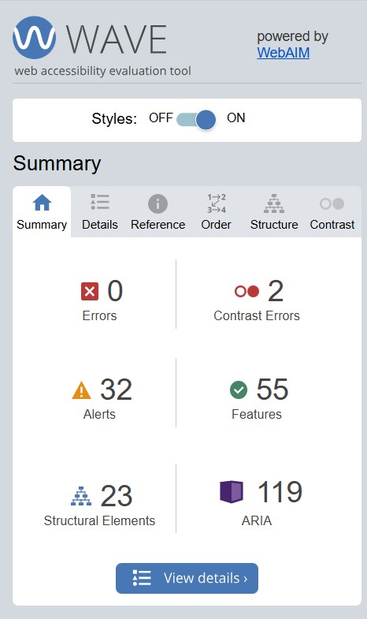
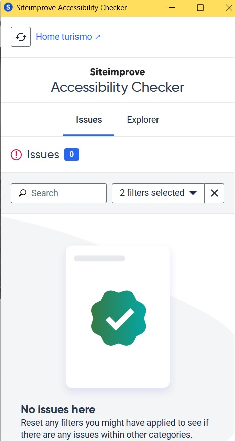
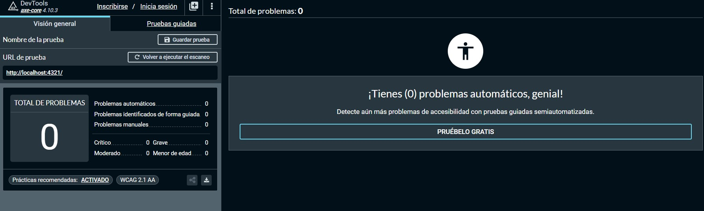

## 🧞 Commandos para arrancar el proyecto

| Commandos                  | Acción                                          |
| :------------------------ | :----------------------------------------------- |
| `npm install`             | Instalar dependencias                            |
| `npm run dev`             | Arranca el servidor local en  `localhost:4321`      |

---

## 📸 Se han realizado pruebas de accesibilidad con herramientas automaticas

### Wave

---

### SiteImprove

---

### Axe

---

# 🎠 Se han realizado pruebas de accesibilidad manuales

1. Todos los elementos interactivos son accesibles mediante navegación por teclado, permitiendo su uso a personas que no utilizan ratón.
2. Se ha verificado que al aumentar el tamaño de fuente al 200% (font-size: 200%), el diseño no se rompe ni se solapan elementos. Todo el contenido sigue siendo visible y usable, cumpliendo con el criterio 1.4.4 Resize text.
3. Se ha probado con el lector de pantalla NVDA para asegurar que los componentes del carrusel comunican información relevante al usuario. Por ejemplo, se anuncian los elementos activos, los botones tienen roles adecuados y hay descripciones adicionales para usuarios con dificultades visuales.

---

## 🧑‍💻 Tecnologías

- HTML
- CSS
- JavaScript Vanilla
- Buenas prácticas de accesibilidad (WAI-ARIA)

---

